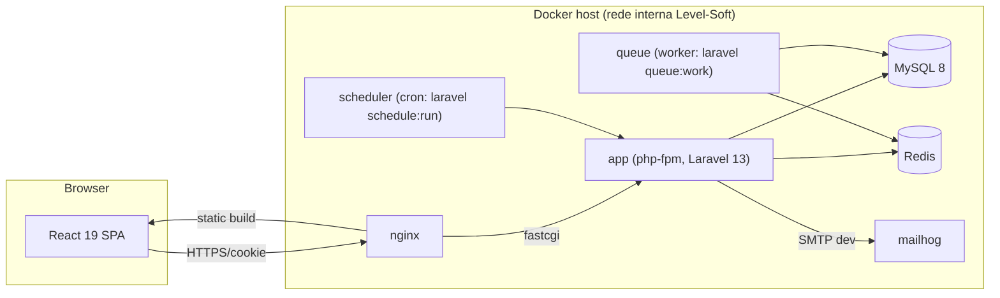

# Arquitectura

## 1. Visão geral

SPA React consumindo uma API REST Laravel, autenticada por sessão via Laravel Sanctum (cookie-based, não tokens Bearer — o frontend é servido pelo mesmo domínio/subdomínio de confiança configurado em `SANCTUM_STATEFUL_DOMAINS`).

Em desenvolvimento, o `frontend` corre no Vite dev server (porta própria, proxy para a API) em vez de build estático servido pelo nginx; em produção o build (`npm run build`) é gerado e servido como ficheiros estáticos pelo nginx.

## 2. Backend (Laravel 13)

- **Camadas**: Controllers finos → Form Requests (validação) → Models/Eloquent → API Resources (serialização). Nenhuma lógica de negócio dentro de controllers; regras complexas em classes de serviço em `app/Services` quando o comportamento ultrapassa um simples CRUD (ex.: `TaskTransitionService`, `CredentialAccessService`).
- **Autenticação**: Sanctum SPA (cookie `laravel_session` + CSRF cookie `XSRF-TOKEN`). Rate limiting nas rotas `login`/`register` via `throttle`.
- **Autorização**: `spatie/laravel-permission` para papéis/permissões globais (`admin`, `project_manager`, `infra`, `member`, `client_viewer`); Laravel Policies por modelo para regras contextuais (ex.: só o `project_manager` do workspace pode apagar o projecto; só `admin`/`infra` acedem ao segredo de uma credencial).
- **Multi-tenancy lógica**: não há isolamento de base de dados por cliente — é um único sistema interno; o "cliente" do módulo de Controlo de Software é apenas uma entidade de negócio, não um tenant técnico.
- **Filas**: Redis + `queue:work` num container dedicado, para notificações e (Fase 2) emails.
- **Agendador**: container `scheduler` corre `php artisan schedule:run` a cada minuto (cron do SO dentro do container) — usado para futuras verificações periódicas de deployments/backups.
- **Auditoria**: tabela `activity_log` (via `spatie/laravel-activitylog` ou implementação própria mínima) para as entidades do módulo de Controlo de Software e para acessos a credenciais.
- **Credenciais**: campo `secret` do modelo `Credential` com cast `encrypted`; nunca presente em `CredentialResource` por omissão — só em `CredentialResource::withSecret()` usado exclusivamente pelo endpoint `POST /credentials/{id}/reveal`, protegido por policy e que grava uma linha em `credential_access_logs`.

## 3. Frontend (React 19 + TypeScript + Vite)

- **Routing**: React Router v7 (rotas aninhadas: layout autenticado com Sidebar/Topbar; rotas públicas de auth).
- **Estado de servidor**: TanStack Query para todo o fetching/caching/mutações; nunca duplicar estado de servidor em `useState`/Context.
- **Estado de UI local**: React Context apenas para o essencial (utilizador autenticado, tema claro/escuro); o resto fica local aos componentes.
- **Formulários**: React Hook Form + Zod (schemas partilhados entre validação de formulário e parsing de resposta da API onde fizer sentido).
- **Kanban**: `dnd-kit` (core + sortable) com actualização optimista via TanStack Query `onMutate`/`onError` (rollback).
- **Design system**: `frontend/src/components/ui` — primitivos Radix estilizados com Tailwind, no espírito shadcn/ui (código copiado/adaptado para o repositório, não uma dependência de runtime pesada). Tokens de cor em CSS variables, suporte a `data-theme="dark"`.
- **Chamadas API**: cliente `axios` único em `src/api/client.ts` com `withCredentials: true`, interceptor de erros 401 → redirect para login, interceptor que injecta o header `X-XSRF-TOKEN` a partir do cookie.

## 4. Infra / Docker

Serviços do `docker-compose.yml`:

| Serviço | Imagem/base | Função |
|---|---|---|
| `nginx` | `nginx:alpine` | Reverse proxy: serve o build do frontend em produção, faz proxy `/api` para `app` |
| `app` | `docker/php/Dockerfile` (php-fpm 8.4) | Laravel — API |
| `queue` | mesma imagem de `app` | `php artisan queue:work --tries=3` |
| `scheduler` | mesma imagem de `app` | `php artisan schedule:work` |
| `mysql` | `mysql:8` | Base de dados |
| `redis` | `redis:alpine` | Cache, filas, sessões |
| `frontend` | `docker/frontend/Dockerfile` (node 20) | Dev: `vite dev --host`; Prod: build multi-stage servido pelo `nginx` |
| `mailhog` | `mailhog/mailhog` | Captura de emails em desenvolvimento |

Ambiente controlado por `.env` (backend) e `.env` (frontend), com `.env.example` versionado. Ver `README.md` para instruções de arranque.

## 5. CI/CD

Ver `specs/ROADMAP.md` §CI/CD e `.github/workflows/`. Resumo:

- `backend-ci.yml`: lint (Pint), análise estática (Larastan), testes (PHPUnit) em cada push/PR que toque `backend/**`.
- `frontend-ci.yml`: lint (ESLint), type-check (`tsc --noEmit`), testes (Vitest), build (`vite build`) em cada push/PR que toque `frontend/**`.
- `docker-build.yml`: valida que as imagens Docker constroem (`docker compose build`) em cada push para `main`.
- Deploy para o servidor interno é manual/documentado no MVP (Fase 1); automatização do deploy fica para Fase 2 (ver ROADMAP).

## 6. Decisões de arquitectura registadas (ADR resumido)

1. **Sanctum SPA em vez de tokens JWT/Passport** — mais simples para um SPA first-party servido pela mesma organização, sem necessidade de tokens móveis nesta fase.
2. **spatie/laravel-permission em vez de ACL manual** — padrão maduro, bem documentado, evita reinventar RBAC.
3. **dnd-kit em vez de react-beautiful-dnd** — react-beautiful-dnd está descontinuado; dnd-kit é mantido e mais flexível para Kanban multi-coluna.
4. **Design system interno (não uma lib de componentes de terceiros)** — controlo total sobre acessibilidade e consistência visual, sem lock-in.
5. **Credenciais encriptadas na própria base de dados (não um cofre externo tipo Vault)** — proporcional à escala (uso interno, hospedagem local); documentado como candidato a evolução em `ROADMAP.md` se a equipa crescer.
