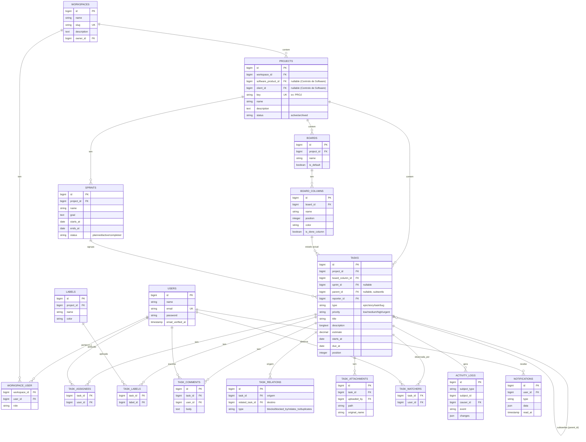
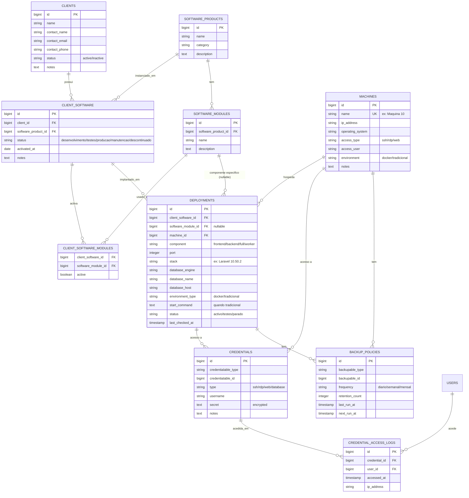
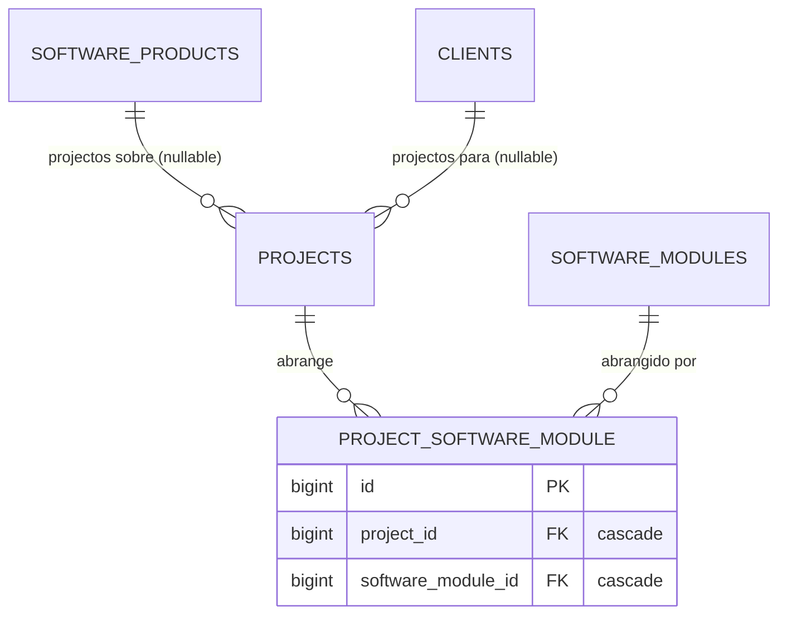

# Modelo de Dados

## 1. ERD — Módulo Gestão de Projectos

## 2. ERD — Módulo Controlo de Software

## 2.1 Ligação entre módulos — Projecto ↔ Controlo de Software

- Tudo opcional: `projects.software_product_id` e `projects.client_id` são FKs nullable com `nullOnDelete` (apagar o produto/cliente não apaga o projecto); `project_software_module` tem `unique(project_id, software_module_id)` e cascata nos dois lados.
- Coerência (validada em `Store/UpdateProjectRequest`): `client_id` exige `software_product_id` e uma instalação (`CLIENT_SOFTWARE`) desse produto nesse cliente; cada módulo pertence ao produto e, havendo cliente, tem de estar activo na instalação desse cliente.
- **"Todos os módulos"**: não há flag dedicada. Uma instalação `CLIENT_SOFTWARE` **sem linhas** em `CLIENT_SOFTWARE_MODULES` tem o software completo (todos os módulos activos); havendo linhas, só as com `active = true` contam (`ClientSoftware::activeModuleIds()`, `null` = todos).
- A ligação entre módulos existe só ao nível de models/relações (`Project::softwareProduct()/client()/modules()`); os controllers continuam separados. O formulário de projecto usa `GET /api/projects/link-options` (só ids/nomes), e os overviews de cliente/software do módulo Infra listam os projectos ligados visíveis ao utilizador.

## 3. Notas de modelação

- `CLIENT_SOFTWARE` é a tabela-chave que resolve "Level-School (Pitruca)" vs "Level-School (Bondo)": mesma `SOFTWARE_PRODUCT`, `CLIENT` diferente, uma linha por instância.
- `DEPLOYMENTS.software_module_id` é nulo quando o deployment cobre o software inteiro; preenchido quando front-end e back-end estão em máquinas diferentes (ex.: Máquina 7 = frontend Angular do Level-RH Pitruca; Máquina 10 = backend Laravel do mesmo).
- `CREDENTIALS` e `BACKUP_POLICIES` são polimórficas (`credentialable`/`backupable`) para poderem associar-se tanto a `MACHINES` como a `DEPLOYMENTS`, reflectindo casos como o computador dedicado a backups que cobre várias máquinas.
- `MACHINES.environment = 'tradicional'` alimenta o alerta de "a migrar para Docker" descrito no PRD.
- Nenhum campo de credencial é devolvido em texto simples por omissão em nenhuma API Resource; ver `ARCHITECTURE.md` §2.
- Enums (`priority`, `status`, `type`, `environment`, etc.) implementados como PHP Enums nativos (`app/Enums`), não strings soltas nem tabelas de lookup — mais simples para o volume de valores fixos do MVP.
